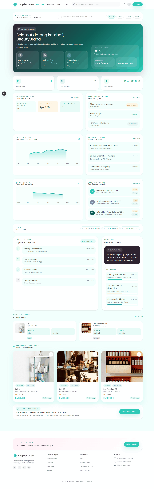
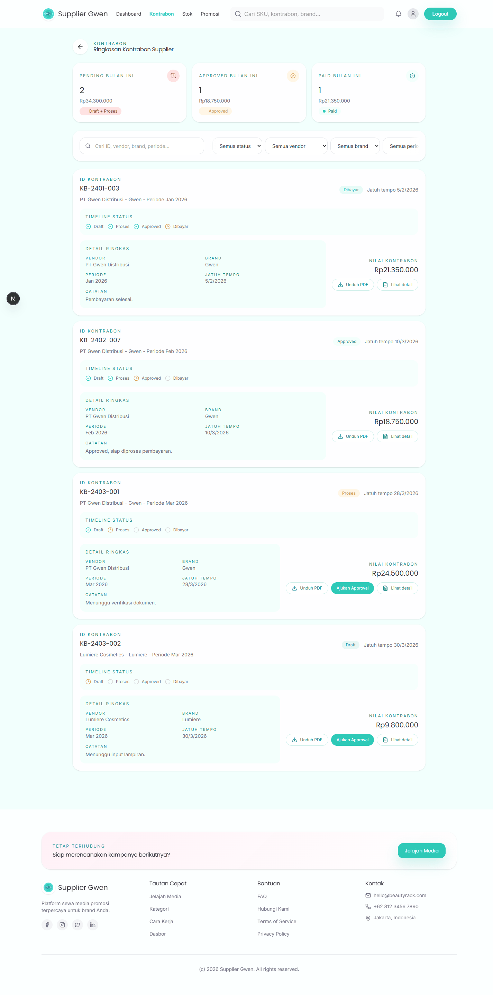
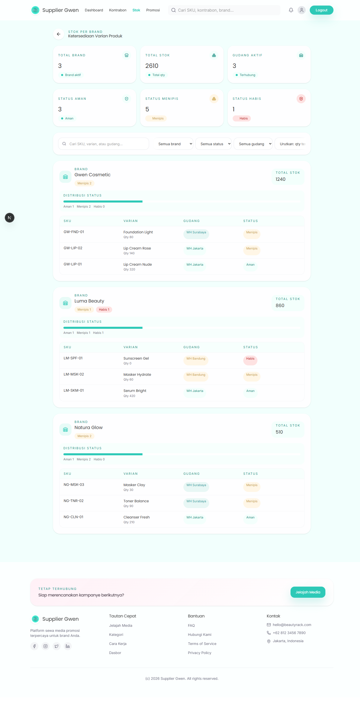
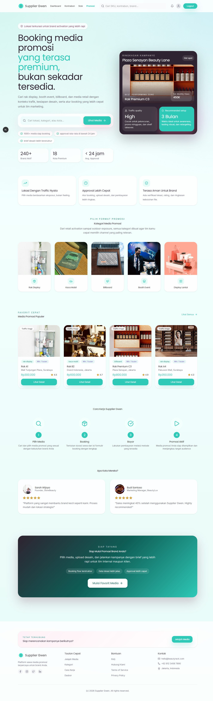
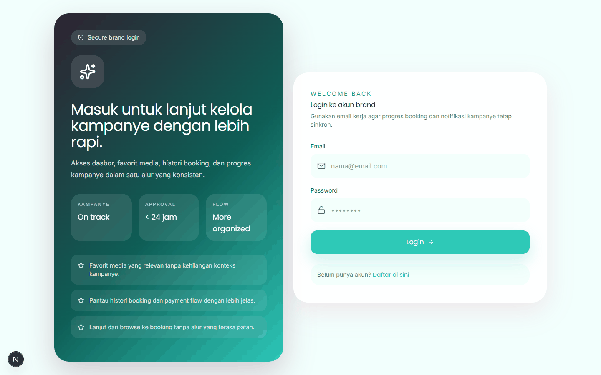

# Supplier Gwen


## Demo

<details>
<summary>Lihat screenshot aplikasi</summary>

| Dashboard | Kontrabon |
| --- | --- |
|  |  |

| Stok | Promosi |
| --- | --- |
|  |  |

| Login |  |
| --- | --- |
|  |  |

</details>

Aplikasi supplier untuk monitoring stok per brand, kontrabon, dan promosi.

## Slogan

Pantau stok, kontrabon, dan promosi dalam satu dashboard.

## Tech Stack

- Next.js (App Router)
- React + TypeScript
- Tailwind CSS
- Framer Motion

## Fitur

- Dashboard supplier untuk ringkasan cepat
- Kontrabon: status, timeline, dan unduh dokumen
- Stok per brand: filter, status, dan detail SKU
- Promosi Gwen untuk materi kampanye

## Instalasi

```bash
npm install
# atau
pnpm install
# atau
yarn install
# atau
bun install
```

## Menjalankan Lokal

```bash
npm run dev
# atau
pnpm dev
# atau
yarn dev
# atau
bun dev
```

Buka http://localhost:3000

## Scripts

- `npm run dev` menjalankan dev server
- `npm run build` build production
- `npm run start` menjalankan server production
- `npm run lint` linting

## Environment

Salin `.env.example` menjadi `.env.local` lalu sesuaikan nilai:

```
NEXT_PUBLIC_SITE_URL=http://localhost:3000
```

## Deployment

1. Build aplikasi: `npm run build`
2. Jalankan: `npm run start`

## Roadmap

- Integrasi API kontrabon & stok (real data)
- Notifikasi real (email/WA/in-app)
- Analytics kampanye untuk supplier

## Contributing

Kontribusi terbuka. Buat branch baru, lakukan perubahan, lalu ajukan Pull Request.

## License

MIT

## Struktur Utama

- app/kontrabon: halaman ringkasan dan detail kontrabon
- app/stock: halaman stok per brand dan detail SKU
- app/promosi: promosi Gwen
